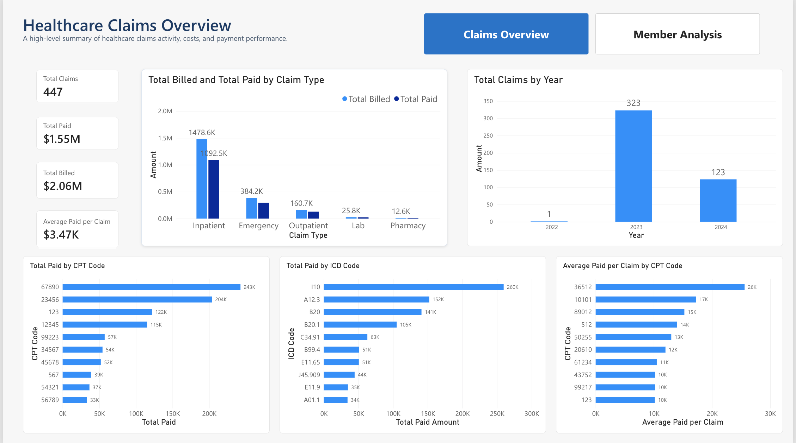
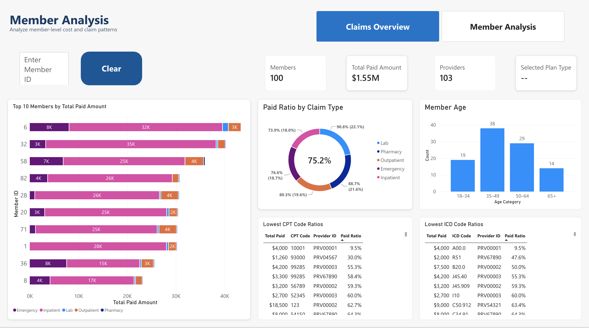

# Healthcare Claims Analysis

## Overview
This project analyzes healthcare claims data to identify spending patterns across claim types, procedures, diagnoses, and members. Data was prepared and queried in SQL, and an interactive dashboard was built in Power BI to visualize cost drivers and reimbursement patterns.

## Data
The dataset contains healthcare claims records with fields for claim type, billed and paid amounts, CPT procedure codes, ICD diagnosis codes, member identifiers, member age, and service year. Data is from an Analyst Builder practice project.

## Dashboard

### Claims Overview

The overview page summarizes spending across the claims portfolio:
- **Total billed and paid by claim type** — comparing charges against reimbursement
- **Total claims by year**
- **Total paid by ICD and CPT code** — identifying the highest-cost diagnoses and procedures
- **Average paid per claim by CPT**

**Paid Amount by Claim Type**

| Claim Type | Total Billed | Total Paid | Total Claims | % of Total Paid |
|------------|-------------:|-----------:|-------------:|----------------:|
| Inpatient  | $1,478,601   | $1,092,456 | 99           | 70.5%           |
| Emergency  | $384,242     | $294,441   | 88           | 19.0%           |
| Outpatient | $160,718     | $129,053   | 105          | 8.3%            |
| Lab        | $25,790      | $23,412    | 76           | 1.5%            |
| Pharmacy   | $12,635      | $11,202    | 79           | 0.7%            |

### Member Analysis

The member page focuses on individual-level spending and reimbursement:
- **Top 10 members by total paid**
- **Paid/billed ratio by claim type** — the share of billed charges actually reimbursed
- **Member distribution by age category**
- **Lowest paid/billed ratios by CPT and ICD code** — procedures and diagnoses with the smallest reimbursement share

## Key Findings
- Inpatient claims accounted for the majority of paid claims spending (about 70%).
- The overall paid/billed ratio is 75.2%.
- The highest-spending member (Member 6) accounted for approximately $43,000 in total paid claims.
- CPT code 67890 accounted for about $243,000 in spending, and ICD code I10 accounted for about $259,000, making them the top procedure and diagnosis cost drivers.
- Claims were concentrated in 2023 (323 claims), followed by 2024 (123) and 2022 (1).

## Recommendations
- **Prioritize inpatient claims for cost management**
  - Inpatient accounts for roughly 70% of total spending, making it high priority item to review utilization and care management.
- **Investigate procedures and diagnoses with low paid/billed ratios**
  - Codes with the smallest reimbursement share may indicate claim denials, coding errors, or underpayment, which warrant review.
- **Target high-cost members for case management**
  - Spending is concentrated among a small number of members, who are strong candidates for targeted case management to improve outcomes and control costs.

## Notes
This project uses a small practice dataset of 447 claims and is intended as a demonstration of SQL data preparation and Power BI dashboard development rather than a substantive clinical or financial analysis. The patterns shown illustrate dashboard functionality and metric design, not generalizable healthcare findings.

## Tools Used
SQL, Power BI
